# Wordpress en local

Manual instalación de Wordpress en local. Para ello será necesario instalar Xampp. Tambien veremos cómo instalar Visual Studio Code.

## Comenzando 🚀

_Estas instrucciones te permitirán obtener una copia del proyecto en funcionamiento en tu máquina local para propósitos de desarrollo y pruebas._

### Pre-requisitos 📋

Será necesario instalar XAMPP y VSC.

### Instalación 🔧
---

Visual Studio Code:
1.  Para iniciar nuestra instalación, el primer paso que deberíamos seguir es el de buscar en nuestro navegador lo siguiente: [Instalar Visual Studio Code](https://code.visualstudio.com/download).
2. Una vez nos encotremos en la página requerida, procederemos a instalar el ejecutable que nos permitirá instalar VSC en nuestro equipo (obviamente, escogeremos la versión correspondiente a nuestro sistema operativo). 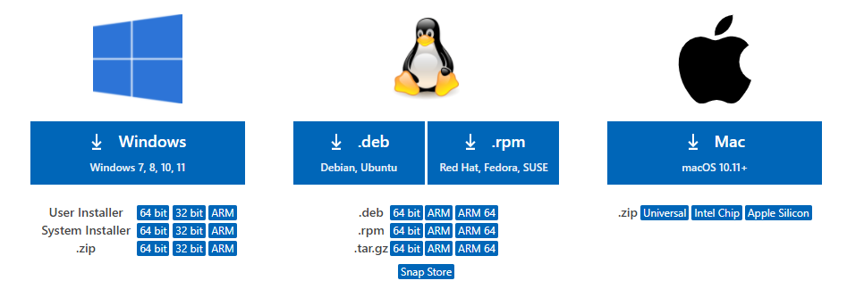
3. Después de que se haya descargado el ejecutable, lo buscaremos en nuestro sistema (seguramente estará en "Descargas").
4. Cuando lo hayamos localizado, lo ejecutaremos haciendo doble clic izquierdo sobre este y comenzaremos con la instalación del programa. Indicamos que aceptamos el acuerdo y pulsamos ***"Siguiente"***. 
5. A continuación indicaremos la ruta (la ubicación) en la cual se instalará el programa. Como podemos ver, el sistema, nos propone una por defecto. Pulsaremos ***"Siguiente"*** 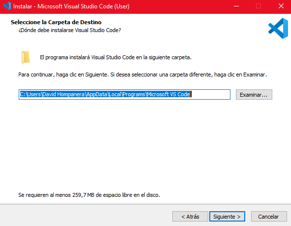
6. Una vez asignada la ruta en la cual se instalará el programa, nos pregunta el nombre del directorio (la carpeta) en el que se guardará. Como podemos observar, el sistema, nos vuelve a proponer un nombre el cual yo he dejado tal y como estaba. Pulsamos ***"Siguiente"*** 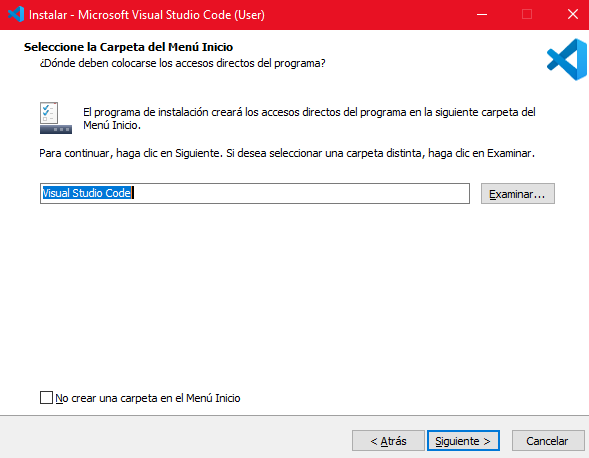
7. En la siguinte ventana se muestran diferentes opciones. Yo las he dejado por defecto, excepto la que dice *"Crea un acceso directo en el escritorio"*, la cuál he seleccionado, ya que era algo que me interesaba. Pulasmos ***"Siguiente"*** 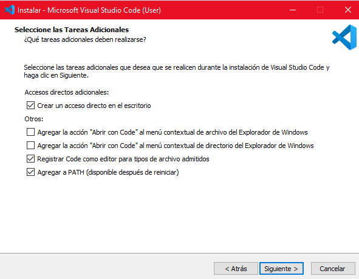
8. A continuación procederemos a instalar el programa. Pulsamos ***"Instalar"*** 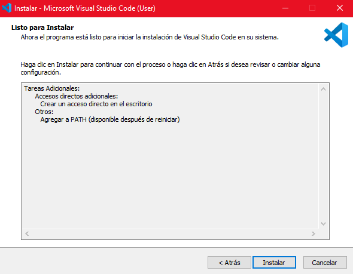
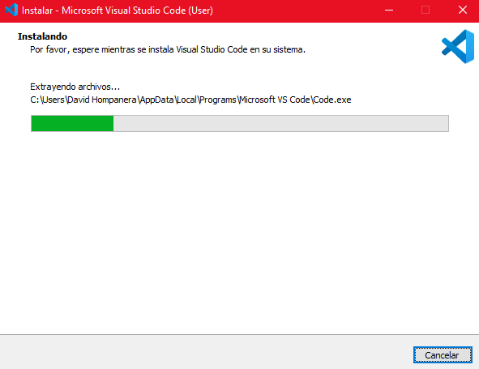
9. Por último pulasermos ***"Finalizar"*** para completar la instalación. 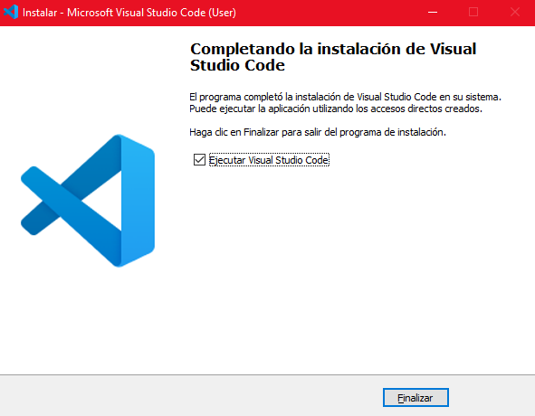

Xampp:
1.  Para iniciar nuestra instalación, el primer paso que deberíamos seguir es el de buscar en nuestro navegador lo siguiente: [Instalar Xampp](https://www.apachefriends.org/es/index.html).
2. Una vez nos encotremos en la página requerida, procederemos a instalar el ejecutable que nos permitirá instalar Xampp en nuestro equipo (obviamente, escogeremos la versión correspondiente a nuestro sistema operativo).
3. Después de que se haya descargado el ejecutable, lo buscaremos en nuestro sistema (seguramente estará en "Descargas").
4. Cuando lo hayamos localizado, lo ejecutaremos haciendo doble clic izquierdo sobre este y comenzaremos con la instalación del programa. Aceptamos el mensaje que podremos ver por pantalla. 
5. A continuación se mostrará la siguiente ventana por pantalla, en la que seleccionaremos ***"Next"***. 
6. En el siguiente paso se nos muestran varias opciones. Yo no he tocado nada, asi que pulsamos ***"Next"*** 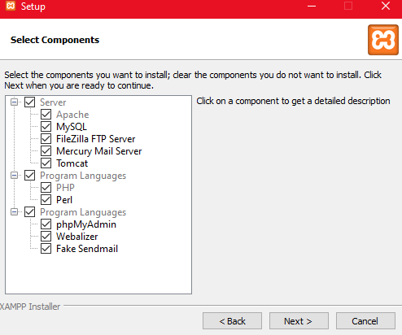
7. A continuación indicaremos la ruta (la ubicación) en la cual se instalará el programa. Como podemos ver, el sistema, nos propone una por defecto. Pulsaremos ***"Next"*** 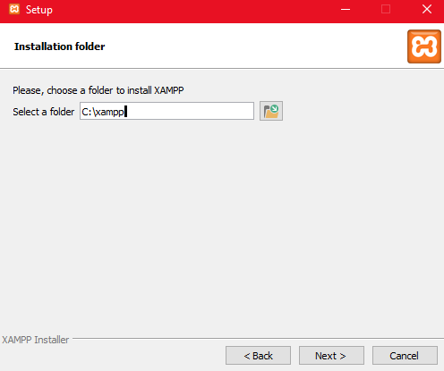
8. Ahora nos preguntará el idimoa en el que queremos tener Xampp, aún que sólo hay dos opciónes. Persnoalmente, la más cómoda de las dos es la ingles, por lo tanto, como ya esta preseleccionada, pulsaré ***"Next"*** 
9. Pulsamos ***"Next"*** 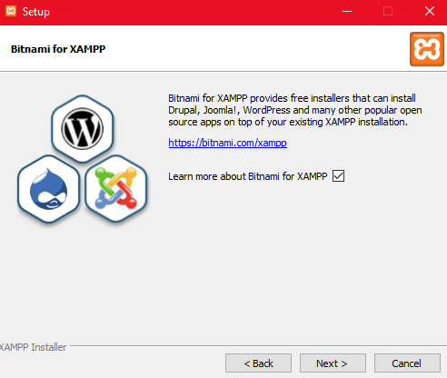
10. Pulsamos, para por fin, iniciar la intalación, ***"Next"*** 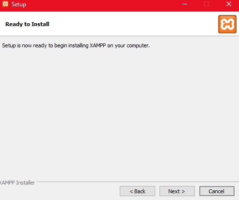
11. Podemos ver como el programa se estaa instalando a continuación: 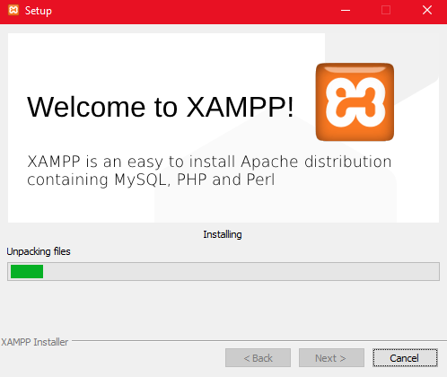
12. Por último pulasermos ***"Finish"*** para completar la instalación. 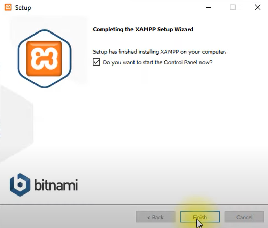

_Finaliza con un ejemplo de cómo obtener datos del sistema o como usarlos para una pequeña demo_

## Despliegue 📦

_Agrega notas adicionales sobre como probar l'app en el hosting (url, usuarios de prueba, password...)._

## Construido con 🛠️

_Menciona las herramientas que utilizaste para crear tu proyecto_

* [Dropwizard](http://www.dropwizard.io/1.0.2/docs/) - El framework web usado
* [Maven](https://maven.apache.org/) - Manejador de dependencias
* [ROME](https://rometools.github.io/rome/) - Usado para generar RSS
* [VSC](https://code.visualstudio.com/) - Usado para editar código fuente y ejecutar comandos

## Contribuyendo 🖇️

Por favor lee el [CONTRIBUTING.md](https://gist.github.com/villanuevand/xxxxxx) para detalles de nuestro código de conducta, y el proceso para enviarnos pull requests.

## Wiki 📖

Puedes encontrar mucho más de cómo utilizar este proyecto en nuestra [Wiki](https://github.com/tu/proyecto/wiki)

## Versionado 📌

Usamos [SemVer](http://semver.org/) para el versionado. Para todas las versiones disponibles, mira los [tags en este repositorio](https://github.com/tu/proyecto/tags).

[Crear una nueva [Release](https://docs.github.com/es/repositories/releasing-projects-on-github/about-releases) para el proyecto acabado (este elemento se encuentra en el apartado About del repositorio) utilizando [SemVer](http://semver.org/) para el tag de la [Release](https://docs.github.com/es/repositories/releasing-projects-on-github/about-releases)]

## Autores ✒️

_Menciona a todos aquellos que ayudaron a levantar el proyecto desde sus inicios_

* **Andrés Villanueva** - *Trabajo Inicial* - [dannylarrea](https://github.com/dannylarrea)
* **Fulanito Detal** - *Documentación* - [fulanitodetal](#fulanito-de-tal)

También puedes mirar la lista de todos los [contribuyentes](https://github.com/your/project/contributors) quíenes han participado en este proyecto. 

## Licencia 📄

Este proyecto está bajo la Licencia (Tu Licencia) - mira el archivo [LICENSE.md](LICENSE.md) para detalles

## Expresiones de Gratitud 🎁

* Comenta a otros sobre este proyecto 📢
* Invita una cerveza 🍺 o un café ☕ a alguien del equipo. 
* Da las gracias públicamente 🤓.
* etc.